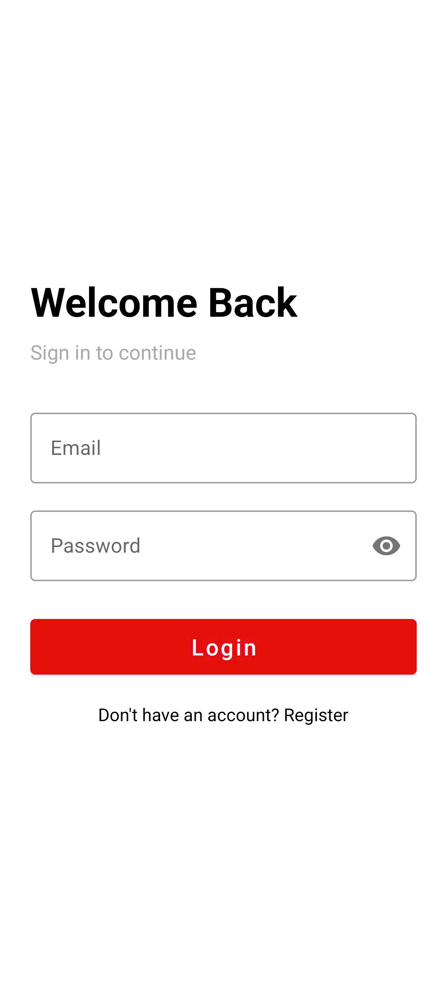
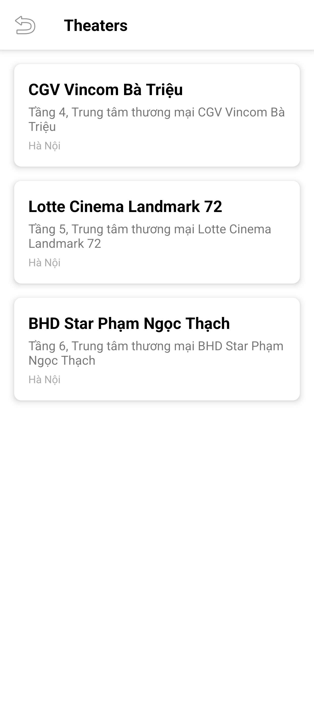
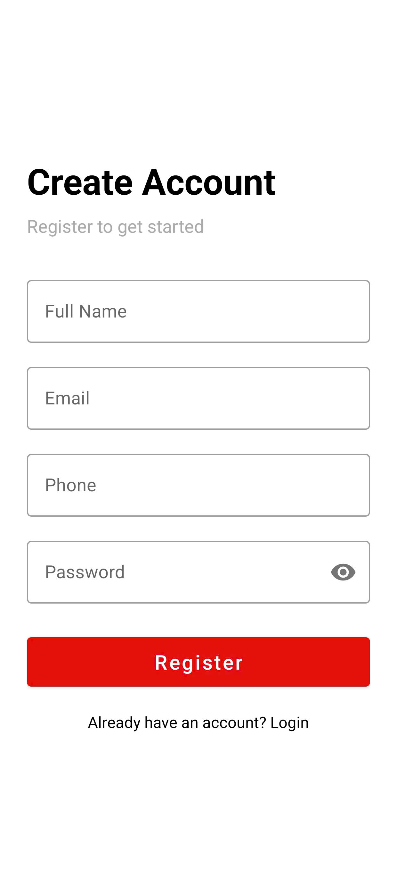
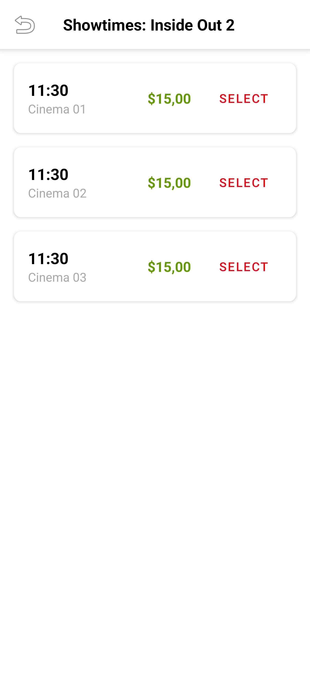
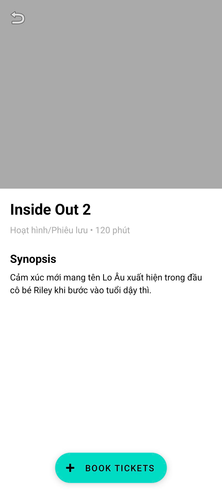
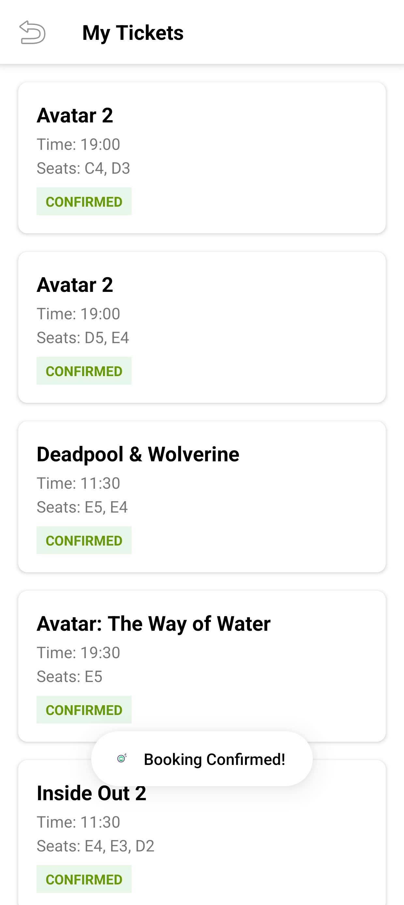
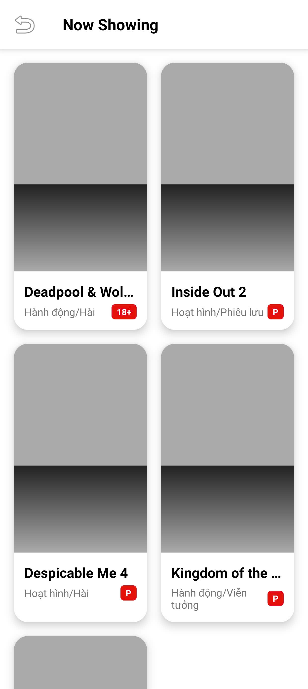
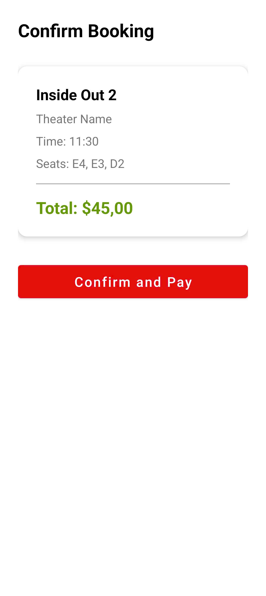
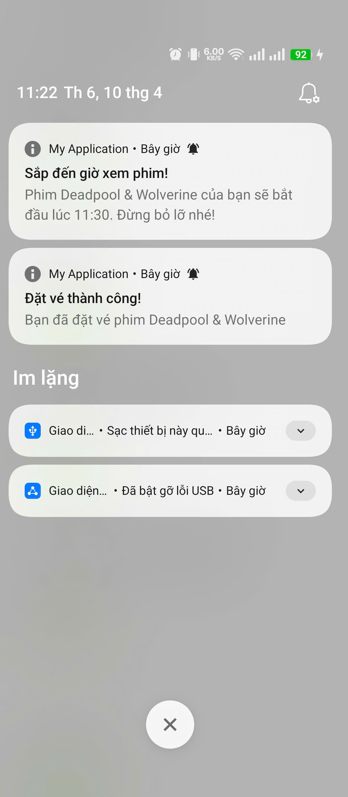

# 📸 Demo Ứng Dụng MovieTicketApp

Dưới đây là các ảnh chụp màn hình minh họa đầy đủ các chức năng của ứng dụng đặt vé xem phim.

---

## 🎬 Giao Diện Ứng Dụng

### 1. Màn Hình Chính

*Giao diện tổng quan của ứng dụng*

---

### 2. Đăng Nhập / Đăng Ký

*Màn hình đăng nhập với Firebase Authentication*

---

### 3. Danh Sách Phim

*Hiển thị các phim đang chiếu với poster và thông tin cơ bản*

---

### 4. Chi Tiết Phim

*Thông tin chi tiết về phim: mô tả, thể loại, thời lượng, đánh giá*

---

### 5. Danh Sách Rạp

*Các rạp chiếu phim có sẵn*

---

### 6. Suất Chiếu

*Danh sách các suất chiếu theo rạp và thời gian*

---

### 7. Chọn Ghế

*Sơ đồ ghế và chọn vị trí ngồi*

---

### 8. Xác Nhận Đặt Vé

*Xác nhận thông tin đặt vé và thanh toán*

---

### 9. Vé Của Tôi

*Quản lý và xem lịch sử vé đã đặt*

---

### 10. Hồ Sơ Cá Nhân

*Thông tin tài khoản và cài đặt người dùng*

---

## 📝 Ghi Chú

- Tất cả các ảnh chụp màn hình được chụp từ ứng dụng đang chạy thực tế
- Dữ liệu hiển thị là dữ liệu mẫu từ Firebase Firestore
- Giao diện tuân thủ Material Design Guidelines
- Ứng dụng hỗ trợ từ Android 7.0 (API 24) trở lên

---

**Ngày cập nhật:** 10/04/2026
